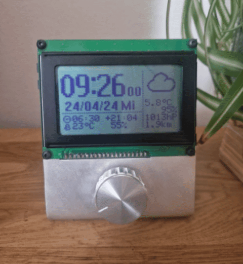

# AVR Weather/Bitcoin Clock
A simple Clock with uses an ESP8266 to get Weather and Crypo currency information.

# Build
Build it using the 'avrgcc' and flash with 'avr dude'

# PCB
The PCB was designed with Kicad.
